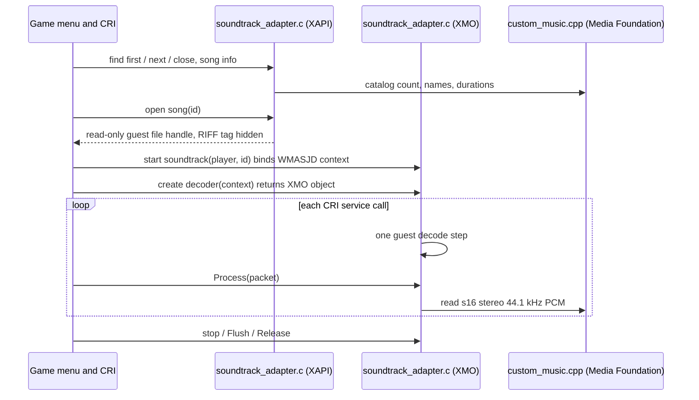

# Custom soundtracks: design, guest contract, and porting notes

This document explains how the recomp plays user MP3, WAV, and FLAC files
through the game's own custom soundtrack feature. It covers how the design was
chosen, the exact guest registers and memory the replacements touch, and how
another Xbox recompilation or emulation project can apply the same pattern.
For player-facing behavior and current verification status, see
[native audio](native-audio.md#custom-soundtracks). Background research and
primary sources are in
[the soundtrack research note](wayfinder/research/og-xbox-custom-soundtracks.md).

## How we arrived at this design

On an original Xbox, the dashboard rips CDs into a soundtrack database and WMA
files on the hard disk. Games list them with the XAPI calls
`XFindFirstSoundtrack`, `XFindNextSoundtrack`, and `XGetSoundtrackSongInfo`,
open a song with `XOpenSoundtrackSong`, and decode the returned WMA handle
with their audio middleware. In this game that middleware is CRI, which feeds
the file through a WMA decoder object (an XMO) and a DirectSound stream.

The design went through four stages.

1. **Recreate the dashboard library.** The first idea was to build a
   compatible soundtrack database and WMA folder under the existing hard-disk
   storage, because static analysis showed the game reading soundtracks
   through ordinary file calls that the runtime already serves. That route
   only works for WMA. MP3, WAV, and FLAC would need a lossy transcode and an
   import step, which conflicted with the requirement to use files as dropped.
2. **Replace the library boundary.** The chosen design keeps the game's
   selection logic and replaces the Xbox library code underneath it, which is
   what the project's rules ask for with XAPI and middleware. Two seams are
   needed: the XAPI catalog (what songs exist) and the WMA decoder object
   (turning a song into PCM). Windows Media Foundation decodes all three
   formats to PCM, so no new dependency was added.
3. **Follow the song through CRI.** Tracing the selected song showed that CRI
   creates its decoder inside a WMA context, the WMASJD context, and expects a
   guest worker thread to pull packets from it. That thread never runs in the
   recomp, so decoding is driven from CRI's own service callback instead.
4. **Fix what play testing exposed.** The first play test crashed in the
   runtime's `vsprintf` replacement, which only knew a few fixed format
   patterns. Selecting a custom song formats a path pattern with a string and
   two zero-padded hex numbers, and the song screens format padded numbers.
   The formatter was generalized. A closed-loop automated run then showed that
   FLAC and MP3 opened the replacement decoder but WAV files never did: CRI
   recognizes a `RIFF` header and plays those files with its own WAV reader.
   The song file handle now hides that header from guest reads.

Rejected alternatives: renaming files to `.wma`, returning decoded PCM from raw
file reads (CRI would still parse it as WMA), and a separate host music player
(it would ignore the game's selection, volume, and stop).

## Architecture

| File | Role |
|------|------|
| `recomp-runtime/custom_music.cpp` | Scans `UserMusic`, builds the catalog, owns Media Foundation readers. No guest knowledge. |
| `recomp-runtime/soundtrack_adapter.c` | Guest-facing XAPI and XMO replacements; maps guest calls onto the catalog. |
| `recomp-runtime/kernel_file.c` | `recomp_kernel_open_readonly`: song files as ordinary guest handles, with an optional read filter. |
| `recomp-runtime/crt_format_model.c` | General `vsprintf` used by the song screens and path building. |
| `recomp-runtime/program_manual.c` | Adds `recomp_soundtrack_lookup_manual` to manual dispatch. |
| `recomp-runtime/runner.cpp` | Scans the folder at startup. At exit, closes every decoder, then stops Media Foundation. |
| `tools/game-recipe/manual-call-targets.json` | Makes generated direct calls to the replaced addresses go through dispatch. |

## Guest contract

All replacements run as guest functions. The recomp's guest register file is
`recomp_runtime.registers`; the helpers in `kernel_abi.h` implement the calling
conventions.

### Registers

| Register | Use |
|----------|-----|
| `ESP` | On entry, `[ESP]` is the return address and argument *n* is `[ESP + 4n]` (`kernel_arg(n)`). |
| `EAX` | Return value. |
| `ESP` on exit | stdcall functions pop the return address and their arguments: `ESP += 4 + 4 * argc` (`kernel_return`). |
| `ECX`, `EDX` | Not used; no replaced function is fastcall or thiscall. The XMO methods take `this` as stack argument 1. |
| All registers and x87 state | Saved and restored around the nested decode step in the service wrapper (see below). |

Wrappers that run the generated original afterwards (`start soundtrack`,
`find_close` and `stop` for handles they do not own) leave `ESP` untouched so
the generated code sees the original stack and performs its own cleanup.
Wrapping the three CRI functions is a deliberate exception to replacing
middleware wholesale: without a guest worker thread the original stop never
finishes, and replacing all of CRI is out of scope for this feature.

Errors reported through `GetLastError` are set by calling the game's own
set-last-error routine at `0x00183183`. The adapter calls it and the generated
originals it wraps in every build; the unit test links small stubs in their
place and records the error codes.

### Replaced functions

Addresses are for the verified disc revision this recipe targets.

| Address | Function | Args | Behavior |
|---------|----------|------|----------|
| `0x00182430` | `XFindFirstSoundtrack(data)` | 1 | Writes one 76-byte record: ID 1, song count, total ms, name `UserMusic`. Returns the single enumerator token, which open enumerations share. Returns `-1` with error 18 when the catalog is empty, 87 for a null record, or 8 if the token cannot be allocated. |
| `0x00182411` | `XFindNextSoundtrack(handle, data)` | 2 | Returns 0 with error 18 (no more soundtracks) for an open token, or error 6 for any other handle. |
| `0x0018145F` | `XFindClose(handle)` | 1 | Closes one open enumeration of the token; other handles go to the generated original. |
| `0x001824DF` | `XGetSoundtrackSongInfo(st, index, id*, ms*, name*, cch)` | 6 | Fills ID, duration, and a UTF-16 name capped at 32 units. |
| `0x00182708` | `XOpenSoundtrackSong(id, async)` | 2 | Opens the host file read-only as a guest handle, or returns `-1` with error 2. |
| `0x00188210` | CRI ADXT start soundtrack `(player, song)` | original | Binds `song` to the player's WMASJD context, then runs the original, which does its own cleanup. |
| `0x0021972A` | In-memory WMA decoder create `(callback, context, yield, format*, xmo**)` | 5 | Opens a Media Foundation reader for the bound song, writes a PCM `WAVEFORMATEX`, returns an XMO object. |
| `0x001880D0` | CRI per-stream service `(audio)` | original | Runs the original, then one decode step for bound contexts. |
| `0x0018D270` | WMASJD stop `(context)` | cdecl | Stops bound contexts synchronously; others go to the original. |

The create function's five-argument shape matches the public XDK
`WmaCreateInMemoryDecoder`; its callback and yield-rate arguments are unused
because the host reader pulls from the file itself.

### XMO object

The returned object is one guest pool dword holding the game's own XMO vtable
pointer, `0x0023F88C`. Every vtable slot address is replaced, so calls through
the vtable land in the adapter, which finds its decoder by `this`. Because the
create function is replaced wholesale, every WMA XMO in the game is one of
these; creation fails for a context that has no bound song.

| Method | Address | Behavior |
|--------|---------|----------|
| `AddRef` | `0x0021945D` | Reference count. |
| `Release` | `0x0021965A` | At zero, closes the reader, frees the object, and empties its slot. |
| `GetInfo` | `0x0021924C` | `XMEDIAINFO`: flags 3 (fixed sample size and packet alignment), output size 4. |
| `GetStatus` | `0x00219271` | 2: accepts output packets. |
| `Process(this, in, out)` | `0x002194B0` | `in` must be null. Fills `out` (`XMEDIAPACKET`: buffer, max size, `*completed`, `*status`, ...) with frame-aligned PCM, up to `RECOMP_MUSIC_MAX_READ` (160000) bytes. A short fill is end of song; a decode error is logged and returns `E_FAIL`. |
| `Discontinuity` | `0x0021926C` | No-op. |
| `Flush` | `0x00218F16` | Rewinds to the start of the song. |

The output format is always PCM, 2 channels, 44100 Hz, 16-bit, block align 4,
so CRI and DirectSound treat it like any other PCM stream. The adapter declares
the guest `XSOUNDTRACK_DATA`, `XMEDIAPACKET`, `XMEDIAINFO`, and
`WAVEFORMATEX` layouts as packed structs with size assertions.

### Memory fields

The game's structures are used in place; the adapter reads and writes only
these fields.

| Location | Meaning |
|----------|---------|
| `player + 4 -> work + 4 -> audio` | Path from the ADXT player handle to its audio object. |
| `audio + 0xBC` | The WMASJD context pointer. The binding key for a song. |
| `context + 0x04` | State: 1 starting, 2 decoding, 3 ended, 4 failed, 0 stopped. |
| `context + 0x08` | Lock. The original stop takes it with a sleeping spin. |
| `context + 0x10` | Stop request. When set, the decode step is skipped. |
| `context + 0x1C` | Worker busy. The original stop waits for the worker to clear it. |

The adapter keeps two small tables. Four bindings map a context to the song
chosen for it; each start overwrites its context's binding. Four XMO slots map
a live object to its host decoder, song, and reference count; create fills a
slot and the final release empties it. Keeping them apart means a restart can
rebind a context while CRI still holds the previous song's object.

### The service step

On the Xbox a WMA worker thread repeatedly runs the context's decode function,
`0x0018CDD0`, which calls the XMO `Process`. The recomp does not run that
thread. After the generated service at `0x001880D0` returns, the wrapper checks
the bound context: in state 1 or 2 with no stop pending, it saves all guest
registers and the x87 state, calls `0x0018CDD0(context)` once, and restores
them, so the service's caller sees exactly the result the generated code
produced. A context in the failed state 4 is changed to ended state 3 before
servicing, so a broken file advances the game instead of stalling it.

This relies on the step never waiting for another thread. The step at
`0x0018CDD0` reads the encoded ring and calls the XMO; no wait was found in it
or its callees. The original stop, by contrast, spins on the context lock and
then waits for the worker-busy flag while driving the other contexts, which
would never finish without a worker. With decoding synchronous, no worker ever
holds the lock or is busy, so the replacement stop for a bound context sets the
state to stopped, clears the lock and busy fields, sets the stop request, and
returns.

### Song file handle

`XOpenSoundtrackSong` must return a real guest handle because CRI queries its
size and reads it before and during playback. `recomp_kernel_open_readonly`
registers a host `CreateFileW` handle in the normal handle table, so the
existing read, query, and close adapters serve it. For these handles only,
the caller can pass a read filter, which `NtReadFile` runs on the bytes after
each host read. The adapter's filter, `hide_riff`, zeroes file offsets 0 to 3.
CRI checks those bytes for `RIFF` and plays matching files with its built-in
WAV reader, which would bypass the replacement decoder; any other header goes
to the XMO. The host file is opened without write access and never modified.

### Shutdown

Decoders hold Media Foundation readers, so the runner's single exit handler
closes every decoder (`recomp_soundtrack_shutdown`) before stopping Media
Foundation (`recomp_music_shutdown`). Guest pool memory is left to the guest
heap. COM is uninitialized only on the thread that initialized it.

## Dispatch and the generation recipe

`recomp_lookup_manual` replaces any guest address reached through dispatch:
indirect calls, vtable calls, and callbacks. That covers the XMO methods and
the CRI service callback. Direct calls are different, because the lifter emits
them as plain C calls to `sub_XXXXXXXX()`. Listing an address in
`manual-call-targets.json` makes the lifter route direct calls to it through
dispatch. Adding the eight directly called addresses changed only call routing,
in eleven generated functions, and requires regenerating the program with the
updated recipe.

## Implementing this in another project

The pattern applies to any Xbox title that supports custom soundtracks, in a
recompilation or in an HLE emulator. Details such as addresses, CRI, and the
WMASJD layout are specific to this game; the steps are general.

1. **Replace the XAPI catalog.** Implement the four soundtrack calls over a
   host folder. One soundtrack keeps menus simple; the XAPI limits are 100
   soundtracks and 500 songs each. Use IDs that survive restarts, such as a
   hash of the filename, because titles may save playlists by song ID.
   Return real errors (`ERROR_NO_MORE_FILES`, `ERROR_INVALID_PARAMETER`)
   through the title's own last-error path.
2. **Return a working file handle from `XOpenSoundtrackSong`.** Titles and
   middleware read, seek, and size-query it. Serve the host file through the
   normal file handle table instead of a special path.
3. **Find the decode boundary.** Follow the handle to where the title or its
   middleware turns WMA into PCM. With an XMO-based decoder, replace its
   create function and every vtable method, and report a PCM format. With a
   direct WMA library call, replace that call. Keep the title's mixing, volume,
   and stop logic.
4. **Check for format sniffing.** Middleware may inspect the first bytes of the
   file and route recognized formats elsewhere. Hide or normalize those bytes
   on the guest view of the handle, or implement the other path too.
5. **Drive decoding without the original worker thread when needed.** If a
   decoder worker thread does not run in your environment, run one decode step
   from a callback the title already services. Save and restore guest
   registers and FPU state around any guest call you add.
6. **Decode on the host.** Media Foundation's Source Reader converts MP3,
   FLAC, and WAV to PCM on Windows. Elsewhere, a small decoder library works
   the same way. Decode incrementally, support rewinding for flush, treat a
   short packet as end of song, and turn decode errors into a normal song end.
7. **Expect side effects.** New screens can reach runtime paths that were never
   exercised before. In this port, that was a formatting routine. Make
   unsupported cases stop loudly so a play test points at the cause.
8. **Test with a closed loop.** Drive input from observed menu state, not
   fixed timings, and log decoder opens per song so an automated run can show
   that every format reaches the decoder. Audible playback still needs a
   person listening.

## Verification

`recomp-runtime-custom-music` writes one-second PCM WAV and float WAV
fixtures to a temporary directory, and encodes FLAC and MP3 fixtures with the
Windows encoders; a missing encoder skips that format with a message. It
checks catalog order, stable IDs, song names, guest error codes (2, 6, 8, 18,
87), the shared enumerator token, and fall-through to the generated originals.
Lossless songs must decode to exactly 1000 ms and 176,400 bytes, and FLAC must
match its source PCM bit for bit; MP3 must land within a tenth of a second.
Every song is decoded whole, and rewind, guest packets, and flush must
reproduce it exactly. Service, stop, failed-track handling, and oversized
packets are covered too. The test reports itself skipped (exit 77) where
Media Foundation is unavailable. `recomp-runtime-four-cases` covers the
`vsprintf` model and adapter.

An automated agent run drove the menus to the Radio Station playlist, and its
log showed a decoder opening for FLAC, MP3, PCM WAV, and float WAV. That is an
agent run, not a play test: natural selection, audible playback, and the
checks listed in [native audio](native-audio.md#custom-soundtracks) await a
user play test.
